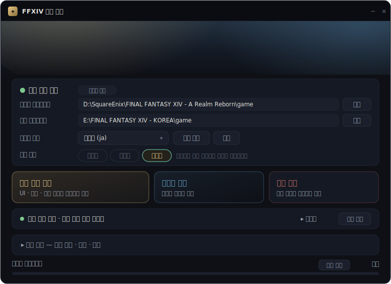

# FFXIV 한글 패치

> ### 🙏 원작자에게 감사드립니다
>
> 이 프로젝트는 FFXIV 한글 패치 원작자 **[korean-patch](https://github.com/korean-patch)** 님의 작업 위에 서 있습니다.
> 어려운 작업을 오랜 시간 이어오시고, 그 결과물과 구현을 아낌없이 공개·공유해 주신 덕분에 이 도구를 만들 수 있었습니다.
>
> 패처 UI의 설치/제거 흐름, 제너레이터의 EXH/EXD 파싱과 `root.exl` sheet 순회, string key 기반 row 매핑, 폰트 리소스 대상 구성 — 이 도구의 뼈대가 되는 아이디어와 구현은 모두 원작자님의 작업에서 배운 것입니다. 진심으로 감사드립니다.
>
> 이 작업본은 그 토대 위에서, 원격 release 다운로드 대신 내 PC의 두 클라이언트로 패치를 직접 생성하도록 구조만 바꾼 확장본입니다.

한국 서버 클라이언트의 한글 리소스를 읽어 **글로벌 서버(일본어/영어) 클라이언트**에 적용하는 한글 패치를 내 PC에서 직접 생성·설치·제거하는 도구입니다. 원격 다운로드 없이 두 클라이언트만 있으면 됩니다.

<div align="center">
  
</div>

---

## 사용법 (일반 사용자)

1. [Releases](https://github.com/qrer321/ffxiv-patch/releases/latest)에서 `FFXIVKoreanPatch.exe`를 받아 **관리자 권한**으로 실행합니다.
2. 글로벌·한국 클라이언트 경로가 자동으로 잡힙니다. 안 잡히면 `변경`으로 지정하세요.
3. 베이스 언어(글로벌 클라이언트 언어)를 고릅니다. — 일본어 `ja` 또는 영어 `en`.
4. 사전 점검이 통과하면 아래 버튼이 활성화됩니다.

| 버튼 | 하는 일 |
|------|---------|
| **전체 한글 패치** | UI · 대사 · 폰트를 전부 한국어로 교체 |
| **폰트만 패치** | 게임 텍스트는 그대로 두고, 채팅의 한글만 표시되게 함 |
| **패치 제거** | 게임 파일을 원본으로 복원 |

- 한글 채팅 입력에 필요한 Scancode Map 레지스트리가 없으면 설치를 안내합니다.
- `원문 유지` 칩(보스명·기술명·상용구)을 켜면 해당 텍스트는 번역하지 않고 원문을 둡니다.
- 고급 기능에서 백업 복구 · 생성/로그 폴더 열기 · 오래된 파일 정리를 할 수 있습니다.

## 요구 사항

- Windows에 **글로벌 클라이언트**와 **한국 서버 클라이언트**가 모두 설치되어 있어야 합니다.
- 두 클라이언트의 `ffxivgame.ver`(버전)가 같아야 합니다. 다르면 오매핑 위험 때문에 패치가 차단됩니다.

---

## 직접 빌드 (AI 없이 툴을 돌리는 경우)

### 준비물

- Visual Studio 2026 (또는 **Build Tools 18**) — MSBuild 경로가 `%ProgramFiles(x86)%\Microsoft Visual Studio\18\BuildTools\MSBuild\Current\Bin\MSBuild.exe`로 고정되어 있습니다.
- .NET Framework 4.8.1 개발 도구 (WPF UI · 제너레이터 · 검증기 모두 프레임워크 타깃).
- 폰트 패키지 `TTMPD.mpd` / `TTMPL.mpl`을 `FFXIVPatchGenerator\FontPatchAssets\`에 두어야 폰트 패치가 만들어집니다. (저장소에는 포함되지 않음)

### 배포용 실행 파일 빌드

```powershell
.\Scripts\build-release.ps1
```

출력: `Release\Public\FFXIVKoreanPatch.exe` (단일 파일). 제너레이터와 폰트 패키지는 exe에 내장되고, 실행 시 `%LocalAppData%\FFXIVKoreanPatch\embedded-tools`로 자동 추출됩니다. 빌드 스크립트가 내장 payload의 SHA256이 방금 빌드한 것과 일치하는지 검증합니다.

테스트 빌드(`Release\Test\FFXIVKoreanPatch.Test.exe`)는 실제 클라이언트에 쓰지 않고 `debug-apply` 폴더에만 적용합니다:

```powershell
.\Scripts\build-test.ps1
```

### 제너레이터만 직접 실행 (UI 없이 CLI)

UI 없이 release 파일만 만들고 싶으면 제너레이터를 직접 호출합니다. 원본 game 폴더에는 절대 쓰지 않고 `--output` 아래에만 생성합니다.

```powershell
# FFXIVPatchGenerator\build.ps1 로 먼저 빌드
.\FFXIVPatchGenerator\bin\Release\FFXIVPatchGenerator.exe `
  --global "D:\...\FINAL FANTASY XIV - A Realm Reborn\game" `
  --korea  "E:\FINAL FANTASY XIV - KOREA\game" `
  --target-language ja `
  --include-font `
  --output "E:\codex\release-ja"
```

| 옵션 | 설명 |
|------|------|
| `--global` / `--korea` | 글로벌 · 한국 서버 `game` 폴더 (필수) |
| `--output` | release 출력 폴더 (필수, 원본 game 폴더 내부면 중단) |
| `--target-language ja\|en` | 글로벌 대상 언어 슬롯 (기본 `ja`) |
| `--include-font` | 텍스트 + 폰트 패치 함께 생성 |
| `--font-only` | 폰트 패치만 생성 |
| `--base-index` / `--base-font-index` / `--base-ui-index` (+ `*-index2`) | clean index 명시 (배포용 권장) |
| `--policy <json>` | 외부 보정 정책 (`patch-policy.example.json` 참고) |
| `--diagnostic-csv <sheet>` | 특정 sheet의 row/column 비교 CSV 출력 |

전체 옵션과 텍스트/폰트/UI 텍스처 패치 방식은 [`FFXIVPatchGenerator\README.md`](FFXIVPatchGenerator/README.md)를 참고하세요.

### 생성물 검증

```powershell
.\Scripts\verify-patch-routes.ps1
```

데이터센터 row, 시간 단위, 파티 리스트 본인 번호, 서드파티(달라무드) 게임 폰트 안전성 등을 게임 실행 전에 확인합니다.

---

## 생성되는 결과물

사용자 데이터는 실행 파일 폴더가 아니라 `%LocalAppData%\FFXIVKoreanPatch\` 아래에 보관됩니다 — 빌드 산출물을 지워도 백업/복구 기준이 남습니다.

```text
%LocalAppData%\FFXIVKoreanPatch\
├─ generated-release\   생성된 패치 release 파일
├─ restore-baseline\    복구용 clean/original index
├─ backups\             적용 전 백업
└─ logs\                작업 로그
```

패치 종류별로 만들어지는 파일:

| 대상 | 생성 파일 | 내용 |
|------|-----------|------|
| 텍스트 (`0a0000`) | `0a0000.win32.{dat1,index,index2}`, `orig.0a0000.win32.index*`, `ffxivgame.ver`, `patch-diagnostics.tsv`, `manifest.json` | UI·대사 텍스트 |
| 폰트 (`000000`) | `000000.win32.{dat1,index,index2}`, `orig.000000.win32.index*` | 한글 폰트 (TTMP 패키지) |
| UI 텍스처 (`060000`) | `060000.win32.{dat4,index,index2}`, `orig.060000.win32.index*` | 파티 리스트 본인 번호 텍스처, `ScreenImage`/`TerritoryType`/`Map` 등 이미지형 UI |

`orig.*.index/index2`는 패치 제거 시 원래 참조로 되돌리기 위한 복구 파일입니다.

## 안전장치

- 원본 글로벌/한국 game 폴더에는 직접 쓰지 않습니다. 출력이 원본 폴더 내부면 중단합니다.
- clean index를 확보하지 못하면(또는 복구 기준이 오염됐으면) 배포용 패치를 만들지 않습니다.
- 글로벌/한국 `ffxivgame.ver`가 다르면 릴리즈 패치를 차단합니다.
- 게임 실행 중에는 실제 적용을 막습니다. 릴리즈 빌드는 사전 점검을 통과해야 적용 버튼이 켜집니다.
- 백업/로그/복구 기준은 `%LocalAppData%` 아래라 빌드 정리의 영향을 받지 않습니다.

## 프로젝트 구조

```text
FFXIVPatchUI/          WPF 대시보드 UI (설치/제거/복구/사전점검)
FFXIVPatchGenerator/   패치 release 파일을 만드는 콘솔 빌더
Scripts/               빌드 · 검증 · 릴리즈 스크립트
Docs/                  기능/릴리즈/이슈 문서
FfxivKoreanPatch.sln   루트 솔루션
```

- [`FFXIVPatchUI/README.md`](FFXIVPatchUI/README.md) — UI 동작, 백업/복구 흐름
- [`FFXIVPatchGenerator/README.md`](FFXIVPatchGenerator/README.md) — 제너레이터 입출력, CLI, 패치 방식
- [`Docs/FEATURES.md`](Docs/FEATURES.md) · [`Docs/RELEASE.md`](Docs/RELEASE.md) · [`Docs/KNOWN_ISSUES.md`](Docs/KNOWN_ISSUES.md)
